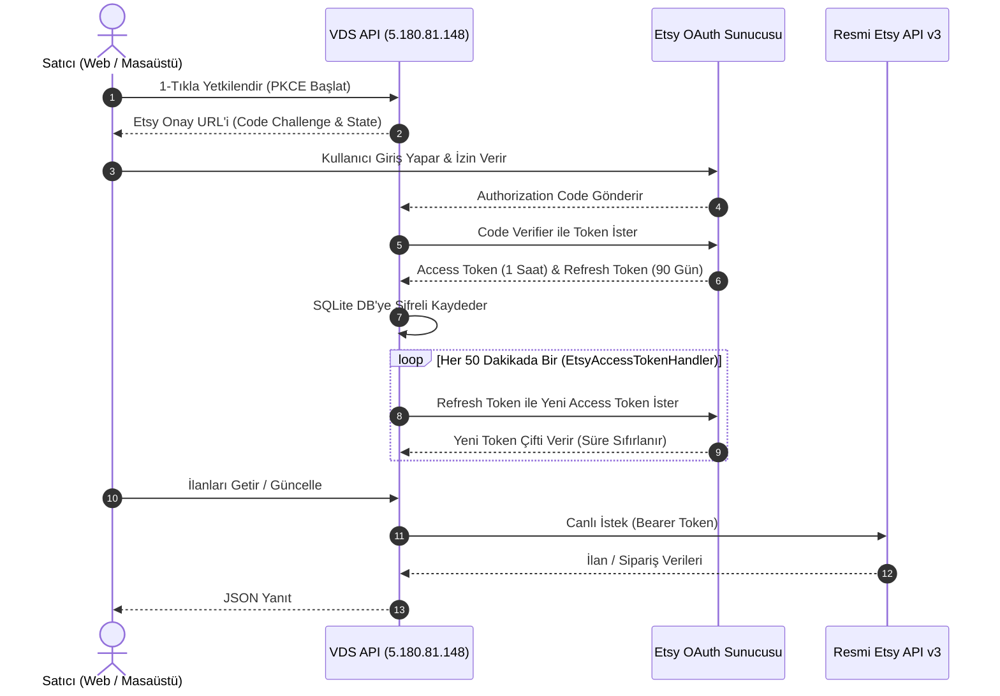

# EtsyMarketPlace: Sistem Mimarisi, Katmanlar ve Yapay Zeka El Kitabı
> **DOKÜMAN STATÜSÜ: SINGLE SOURCE OF TRUTH (TEK GERÇEKLİK KAYNAĞI)**  
> **HEDEF KİTLE:** Sisteme yeni dahil olan insan yazılımcılar ve projede kod yazacak **TÜM YAPAY ZEKA MODELLERİ (AI AGENTS)**.  
> **ZORUNLULUK:** Bu projede kod yazacak veya değişiklik yapacak herhangi bir yapay zeka ajanı, herhangi bir dosyayı değiştirmeden önce bu el kitabını okumak ve buradaki mimari ilkelere uymakla yükümlüdür.

---

## 1. Giriş ve Sistemin Var Oluş Amacı (The Big Why)

### Etsy Pazarının Zorlukları ve Tehlikeleri:
Etsy, el yapımı, vintage ve özel tasarım (özellikle 3D baskı) ürünler için dünyanın en büyük pazar yeridir. Ancak Etsy'de satış yapan bir satıcının karşısına 4 büyük risk çıkar:

1. **Mağaza Kapanmaları (Anti-Ban & Mağaza Güvenliği):**  
   Etsy botları, yüklenen fotoğrafların **EXIF meta verilerini** ve **görsel parmak izlerini (pHash)** tarar. İnternetten veya başka bir mağazadan kopyalanmış görsel tespit edildiğinde veya şüpheli IP/cihaz hareketinde mağaza kalıcı olarak askıya alınır (Suspend/Ban).
2. **Karmaşık ve Gizli Etsy Kesintileri (Hatalı Kâr Algısı):**  
   Satıcılar genellikle $50'a sattıkları bir üründen $30 kâr ettiklerini zanneder. Oysa Etsy; %6.5 işlem komisyonu, %3 + $0.25 ödeme işleme bedeli, $0.20 listeleme ücreti, %2.5 döviz dönüştürme farkı ve %12 - %15 Offsite Ads (Dış Reklam) kesintisi uygular. Kargo navlunu ve hammadde eklendiğinde gerçek kârın zarara dönüştüğü çok geç fark edilir.
3. **Etsy Arama Algoritması (SEO) ve 13 Etiket Kuralı:**  
   Etsy, ürün başlığında en fazla 140 karaktere ve en fazla 13 arama etiketine (her biri ≤20 karakter) izin verir. Eksik etiket (<13), telifli marka kelimesi (Disney, Nike vb.) veya alakasız başlık kullanıldığında ilan aramalarda geriye düşer veya telif ihlali (DMCA) alır.
4. **Uluslararası Kargo ve Gümrük (GTİP) Karmaşası:**  
   Amerika, İngiltere veya Almanya'ya ürün gönderirken Aras Global, ShipEntegra, Navlungo ve Shiptomore arasında navlun kıyaslaması yapmak, GTİP (Gümrük Tarife İstatistik Pozisyonu) kodu bulmak ve termal barkod basmak saatler sürer.

### Bu Sistemin Sunduğu Çözüm:
**EtsyMarketPlace**, satıcının tüm mağaza operasyonlarını tek merkezden yöneten hibrit bir otomasyon, finans ve yapay zeka ekosistemidir.

---

## 2. Büyük Resim: Genel Mimari ve 4 Temel Katman

Sistem 4 ana katmandan oluşur ve bu katmanlar birbirleriyle REST API, WebSocket ve yerel SQLite veri tabanı üzerinden haberleşir:

```mermaid
graph TD
    subgraph Client_Layer [1. İSTEMCİ KATMANI]
        DesktopApp["🖥️ Masaüstü Uygulaması (WinForms .NET 8)<br/>• SkiaSharp EXIF Soyma & pHash Kırma<br/>• Termal Yazıcı (ZPL/PDF) USB/Ağ Erişimi<br/>• .etsyvault Şifreli Arşivleme<br/>• SQLite Model Lake"]
        WebApp["🌐 Web Kokpiti (Angular 18 Standalone)<br/>• Modern Dark Cyberpunk SaaS Arayüzü<br/>• 18 Reaktif Modül (RxJS + Signals)<br/>• Anlık VDS Audit & Token Takibi<br/>• Çift Para Birimi ($ / ₺) Finans"]
    end

    subgraph Backend_Layer [2. MERKEZİ VDS API SUNUCUSU (5.180.81.148:5263)]
        VdsApi["⚡ ASP.NET Core Minimal API<br/>Program.cs / SQLite WAL Modu"]
        EtsyHandler["🔑 EtsyAccessTokenHandler<br/>(90 Günlük Otomatik Token Yenileme)"]
        AuditService["🛡️ AuditLog & Güvenlik Takibi"]
        Database["🗄️ SQLite Veritabanı (EtsyMarketPlace.db)"]
    end

    subgraph AI_Engine [3. YAPAY ZEKA MOTORU]
        GeminiFlash["🧠 Google Gemini 2.5 Flash / Spark (Birincil)"]
        VisionStudio["🎨 Vision AI & Görsel Dekupe / Mockup Motoru"]
        MultiLLM["🔄 Çoklu Sağlayıcı (OpenAI, Claude, DeepSeek, Grok)"]
        OfflineEngine["⚙️ Offline Heuristic Kural Motoru (Kesinti Koruması)"]
    end

    subgraph External_Services [4. DIŞ DÜNYA ENTEGRASYONLARI]
        EtsyV3["🛍️ Resmi Etsy API v3 (OAuth PKCE)"]
        Carriers["🚚 Kargo Entegrasyonları (Aras, ShipEntegra, Navlungo, Shiptomore)"]
        ExchangeRateApi["💱 Canlı Döviz Kuru Motoru (open.er-api.com)"]
    end

    DesktopApp <-->|REST & Local SQLite| VdsApi
    WebApp <-->|REST /api/*| VdsApi
    VdsApi <--> AI_Engine
    VdsApi <--> EtsyV3
    VdsApi <--> Carriers
    VdsApi <--> ExchangeRateApi
    DesktopApp -.->|Doğrudan Kargo API| Carriers
```

---

## 3. Masaüstü (WinForms) vs Web (Angular): Neden İkisi Birden Var?

Sistem tek bir platform yerine **Hibrit Mimari** ile inşa edilmiştir:

| Özellik / Senaryo | Masaüstü Uygulaması (WinForms) | Web Uygulaması (Angular 18) |
| :--- | :--- | :--- |
| **Kullanım Amacı** | Ağır donanım, yerel dosya işleme, atölye/depo yönetimi | Bulut SaaS kokpiti, analiz, hızlı yönetim, uzaktan erişim |
| **Fotoğraf & Anti-Ban** | **SkiaSharp** ile saniyede 100+ görselin EXIF verisini sıfırlama, pHash bozma | Cloud mockup oluşturma, web üzerinde arka plan dekupe önizleme |
| **Kargo & Etiket Basımı** | USB / Ağ termal etiket yazıcılarına doğrudan **ZPL / ESC** kodları gönderme | Canlı kargo navlun karşılaştırma, siparişe kargo navlunu atama |
| **Veri Güvenliği** | İnternet olmadan çalışabilen yerel SQLite Model Lake ve `.etsyvault` | Merkezi VDS sunucusuna bağlı SQLite veri tabanı (`5.180.81.148:5263`) |
| **Kullanıcı Deneyimi** | Yüksek performanslı Windows kontrolleri, klavye kısayolları | Modern Cyberpunk estetik, animasyonlu grafikler, mobil uyumlu |

---

## 4. Sistemin 6 Temel İşlevsel Sütunu

### 1. ⚡ AI Destekli Ürün Ekleme (Fast Creator & Batch Queue)
- **Konum:** `client/etsy-web/src/app/features/listings/fast-creator.component.ts` & `/tools/batch-queue.component.ts`
- **İşleyiş:**
  1. Kullanıcı sadece ürün adını veya bir fotoğrafı sisteme verir.
  2. Gemini 2.5 Flash devreye girerek:
     - 140 karakterlik, aramalarda en üst sıraya çıkaran **SEO Başlığını** oluşturur.
     - Etsy'nin izin verdiği tam **13 adet arama etiketini** (her biri ≤20 karakter) tespit eder.
     - Maddeler halinde, kargo, malzeme ve bakım detayları içeren **açıklama metnini** yazar.
  3. Kullanıcı "Tek Tıkla Taslak Ekle" diyerek ürünü canlı Etsy mağazasına taslak (Draft) olarak gönderir.
- **Toplu İşleme (Batch Queue):** 50 adet ürün sıraya eklenir, yapay zeka sırayla her birinin SEO başlık, etiket ve açıklamalarını otomatik üretip kuyrukta bekletir.

### 2. 🤖 AI Mağaza Listing Denetimi, Puanlama & Canlı Düzeltme (AI Audit Studio)
- **Konum:** `client/etsy-web/src/app/features/analytics/ai-audit.component.ts` & WinForms `Forms/OwnShopListingAiAuditForm.cs`
- **İşleyiş:**
  1. **Tüm Mağazayı Canlı Tarama:** `GET /api/etsy/listings/active` ile mağazanın tüm aktif ilanları çekilir.
  2. **0-100 Puanlama:** Eksik etiket (<13), 140 karakterden çok kısa başlık, kalitesiz açıklama veya Disney/Marvel/Nike gibi marka ihlali riski taşıyan kelimeler tespit edilir.
  3. **Before / After Karşılaştırması:** Orijinal başlık/etiket seti ile yapay zekanın optimize ettiği versiyon yan yana gösterilir.
  4. **Canlı Etsy Güncellemesi:** "🎉 Etsy'de Güncelle" butonuna basıldığında değişiklikler doğrudan resmi Etsy API v3 (`PUT /v3/application/shops/{shop_id}/listings/{listing_id}`) üzerinden canlı yayına alınır.

### 3. 🎨 AI Fotoğraf Stüdyosu & Anti-Ban Resim Koruma (AI Studio & Shop Vault)
- **Konum:** `client/etsy-web/src/app/features/ai-studio/ai-studio.component.ts` & WinForms `Controls/ShopVaultCatalogControl.cs`
- **İşleyiş:**
  - **Dekupe (Arka Plan Silme):** Ürün fotoğraflarının arka planı yapay zeka ile tek tıkla şeffaflaştırılır.
  - **Mockup Sahneleme:** Ürün, profesyonel bir oturma odası veya modern stüdyo fonuna fotogerçekçi olarak yerleştirilir.
  - **SkiaSharp EXIF & pHash Temizliği:** Fotoğrafın çekildiği makine, lens, GPS ve oluşturulma tarihi meta verileri tamamen silinir. Görsel parmak izi (pHash) piksel seviyesinde hafifçe kırılarak Etsy botlarının hesabı başka mağazalarla eşleştirmesi imkansız kılınır.
  - **.etsyvault Şifreli Yedekleme:** Mağazadaki tüm ürünler, etiketler, fiyatlar ve görseller AES-256 ile şifrelenip tek bir `.etsyvault` dosyasında yedeklenir. Mağaza kapansa bile yeni bir mağazaya 10 saniyede aktarılabilir.

### 4. 💰 Satılan Ürünlerin Gerçek Net Kârı & Finansal Muhasebe (Profit & Cost Engine)
- **Konum:** `client/etsy-web/src/app/features/finance/profit-calculator.component.ts`, `product-cost-manager.component.ts`, `accounting.component.ts`, `orders.component.ts`
- **İşleyiş:**
  - **Gerçek Net Kâr Hesaplayıcı:** Etsy %6.5 işlem komisyonu, %3 + $0.25 ödeme kesintisi, $0.20 listeleme, %2.5 döviz farkı ve %12-15 Offsite Ads düşüldükten sonra elde kalan gerçek para hesaplanır.
  - **Çift Para Birimi ($ / ₺):** Canlı TCMB/açık döviz kuru motoru ile anlık Dolar ve Türk Lirası karşılıkları hesaplanır.
  - **Ürün Maliyet Yöneticisi:** Her ilanın filament/üretim maliyeti, koli maliyeti ve kargo maliyeti `etsy_product_costs_v1` veritabanında saklanır.
  - **Sipariş Bazlı Kâr Analizi:** Gelen her siparişin brüt cirosu ile net kârı (Gross vs Net Margin) renkli kâr çubuğu ile gösterilir.

### 💹 Finansal Veri Akışı (Güncel Mimari — VDS Sunucu Finans Motoru)
- **Kaynak:** Web finans KPI'ları (Bu Ayki Brüt Ciro, Gerçek Net Kâr, kesinti kırılımı) **VDS sunucu finans motorundan** beslenir: Etsy ödeme hesabı defteri (`payment-account/ledger-entries`) sunucudan **canlı** okunur ve masaüstü `FinancialReportService` mantığının birebir portuyla işlenir (`src/EtsyMarketPlace.Application/EtsyIntegration/EtsyLedgerFinancialEngine.cs` + `EtsyLedgerReportService.cs`; uçlar: `GET /api/etsy/financial/performance`, `financial/daily-series`, `financial/analysis`, `shop/daily-brief`).
- **Kural:** Masaüstü uygulamasının VDS'e gönderdiği günlük özetler ve `financial_transactions` tablosundaki ham senkron satırları **web KPI kaynağı DEĞİLDİR** (yalnız yedek/uyumluluk amaçlı saklanır).
- **Parite sözleşmesi, referans değerler ve doğrulama adımları:** `docs/finans-motoru-ve-parite.md` — finans kodu değiştirmeden önce mutlaka okuyun.

### 5. 🏬 Mağaza Bilgileri & Ziyaretçi Analitiği (Shop Performance Cockpit)
- **Konum:** `client/etsy-web/src/app/features/analytics/shop-performance.component.ts` & `dashboard.component.ts`
- **İşleyiş:**
  - Mağazanın günlük ve aylık görüntülenme, ziyaretçi sayısı, favori ekleme ve dönüşüm oranları (Conversion Rate %) grafiklerle raporlanır.
  - Trafik almayan veya favorilenmeyen ölü ilanlar için "Kırmızı Alarm" verilir; tek tıkla AI Audit modülüne gönderilerek optimize edilir.

### 6. 🚚 4 Taşıyıcılı Kargo & Akıllı Sipariş Karşılama (Order Fulfillment Studio)
- **Konum:** `client/etsy-web/src/app/features/shipping/shipping-hub.component.ts` & `orders.component.ts` & WinForms `OrderFulfillmentStudioV2Control.cs`
- **İşleyiş:**
  - **4 Taşıyıcı Karşılaştırması:** Aras Global, ShipEntegra, Navlungo ve Shiptomore arasında ağırlık ve ebat (desi) girilerek canlı navlun sorgulanır.
  - **GTİP Gümrük Kodlama Motoru:** Ürünün uluslararası gümrük tarife kodunu (HS Code - Örn: 3926400000 3D Plastik Heykelcik) otomatik eşler.
  - **Siparişe Aktarma:** Kargo Hub'ında hesaplanan en uygun navlun tek tıkla bekleyen siparişe aktarılır.
  - **Termal Barkod Basımı:** Siparişin konşimentosu ve barkodu termal etiket formatında (ZPL / PDF) hazırlanır.

---

## 5. Etsy API v3 & OAuth PKCE Yaşam Döngüsü

Etsy API v3, yüksek güvenlikli **OAuth 2.0 PKCE** mimarisini kullanır:



> **Önemli Kural:** Satıcı sisteme bir kere giriş yaptıktan sonra `EtsyAccessTokenHandler` arka planda token'ı sürekli canlı tutar. Kullanıcının tekrar tekrar şifre girmesine gerek kalmaz.

---

## 6. Yapay Zeka Ajanları İçin Bağlayıcı Kurallar (AI Guardrails)

Bu projede görev alan her yapay zeka modeli aşağıdaki kuralları **istisnasız** uygulamak zorundadır:

### 🚨 Kural 1: Git Dallanma (Branch) Kuralı
- Asla doğrudan `development` veya `main` dalları üzerinde kod yazılmaz!
- Her görev için:
  1. `git checkout development`
  2. `git pull origin development`
  3. `git checkout -b feature/<kisa-ad>` veya `git checkout -b fix/<kisa-ad>`
  4. Geliştirme tamamlanıp testler geçince `development` dalına merge edilip `origin/development`'a pushlanır.

### 🚨 Kural 2: Sıfır Hata & Test Bütünlüğü Kuralı
- Kodlama tamamlandığında şu üç test komutu çalıştırılmalı ve **0 HATA** doğrulanmalıdır:
  1. Web: `cd client/etsy-web && npm run build`
  2. Masaüstü & API: `dotnet build SimilarProductsWinForms.csproj -c Release`
  3. Test Paketi: `dotnet test` (**631 / 631 test başarıyla geçmelidir**)

### 🚨 Kural 3: Sıfır Mock (Gerçekçi Entegrasyon) İlkesi
- Arayüzde veya servislerde uydurma/temsili sabit veriler (mock data) bırakılamaz.
- Tüm veriler VDS API (`http://5.180.81.148:5263/api/*`) ve yerel SQLite veritabanı üzerinden beslenmelidir.

### 🚨 Kural 4: Etsy Algoritma Kısıtlamaları
- Başlık uzunluğu asla 140 karakteri geçemez.
- Etiket sayısı tam olarak 13 adet olmalıdır.
- Hiçbir etiket 20 karakterden uzun olamaz.
- Marka ihlali (Trademark) içeren kelimeler temizlenmelidir.

### 🚨 Kural 5: Masaüstü ve Web Kapsam Ayrımı
- Kullanıcı "Web'de düzelt" dediğinde masaüstü WinForms koduna dokunulmaz.
- Kullanıcı "Masaüstünde geliştir" dediğinde web frontend kodları bozulmaz.
- Her iki platform da VDS API'nin ortak sözleşmelerine (DTO) sadık kalmalıdır.
